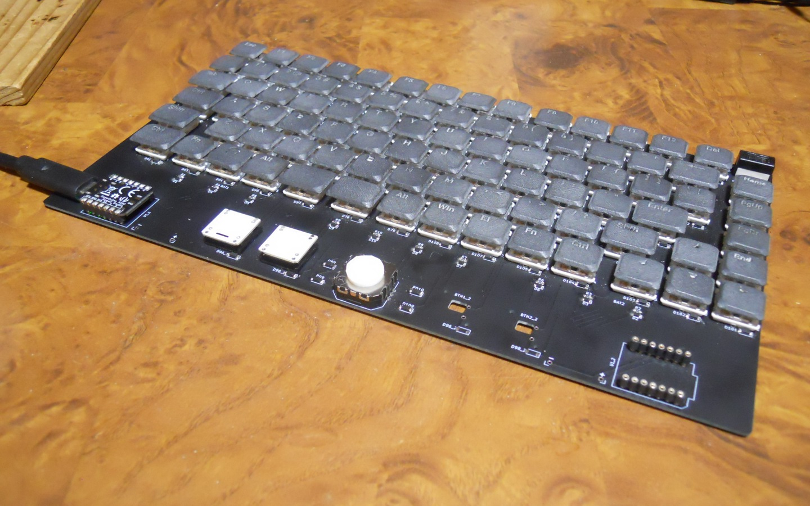

# xiao 75% keyboard について

xiao 75% keyboard は、下記の特徴を持つ、75%キーボードです。
* 16mm×16mmの狭ピッチ。
* Kailh PG1232 Mini Choc または Kailh PG1350 Choc (V1) に対応。
* アナログスティックによるマウス機能搭載、マウスボタンには Kailh X Switch を採用。
* コントローラーに Seeed XIAO を採用。
* USBケーブルを出す方向を、右と左を選択可能。
* キースイッチ用にバックライトを取り付け可能。

# 組み立てに必要なパーツ

## キーボード本体

* 86x [Kailh PG1232 mini choc switch](https://www.aliexpress.com/item/4000277394324.html) または [Kailh PG1530 choc switch](https://shop.yushakobo.jp/products/pg1350)
  * キーボードスイッチ用
* 2x [Kailh PG1425 X switch](https://shop.dailycraft.jp/products/x_switch)
  * マウスボタン用
* 1x [TOP-UP JT8P-3.2T-B10K-1-16Y](https://akizukidenshi.com/catalog/g/gP-04048)
  * ポインティングデバイス
* 1x [Seeed XIAO](https://akizukidenshi.com/catalog/g/gM-15178)
  * Seeed XIAO
  * ピンヘッダが実装されていない物を使用します。
* 88x [1N4148W](https://akizukidenshi.com/catalog/g/gI-07084)
  * SOD-123 表面実装 スイッチングダイオード
* 4x [SS2040FL](https://akizukidenshi.com/catalog/g/gI-02073)
  * SOD-123 表面実装 低 Vf ダイオード
* 10x [表面実装抵抗 560Ω 1608サイズ](https://www.sengoku.co.jp/mod/sgk_cart/detail.php?code=EEHD-57GE)
* 10x [1SS355VM](https://akizukidenshi.com/catalog/g/gI-05866)
  * SOD-323 表面実装 スイッチングダイオード
* 2x [7P 丸ピンICソケット](https://akizukidenshi.com/catalog/g/gP-01014)
  * USBケーブルを出す方向を、左右切り替えたい場合、4個。
  * 丸ピンICソケットは切断しづらいので、切断済みをおすすめします。
* 1x [14P 細ピンヘッダ](https://akizukidenshi.com/catalog/g/gC-04397)
  * 真ん中で切断し、 7P 2個にします。
* 1x キーボード基板
* 1x キーキャップ1セット
  * Kailh Choc 用 16x16 ピッチ用 1u 77個
  * Kailh Choc 用 16x16 ピッチ用 1.25u 9個
  * アナログスティック用キャップ 1個
  * Kailh X Switch用キーキャップ 2個

## バックライトLED

本キーボードのバックライトLEDは、マイコンとは独立したスイッチにより、点灯/消灯する仕様となっています。
マイコン制御によるLEDには対応していません。
バックライトLEDを仕様する場合、下記の部品が必要となります。
* 86x [表面実装LED 2012サイズ](https://akizukidenshi.com/catalog/g/gI-06422)
  * 未検証ですが、もしかすると、1608サイズの方がよいかもしれません。
* 86x [表面実装抵抗 2.2kΩ 2012サイズ](https://www.sengoku.co.jp/mod/sgk_cart/detail.php?code=EEHD-57C4)
  * LEDの仕様に応じて、抵抗値は変更してください。
  * 未検証ですが、もしかすると、1608サイズの方がよいかもしれません。
* 1x [NJM12888-33](https://akizukidenshi.com/catalog/g/gI-10675)
  * 3.3V 電圧レギュレーター
* 2x [2012サイズ 0.1uF 表面実装コンデンサ](https://akizukidenshi.com/catalog/g/gP-00349)
* 1x [2012サイズ 1uF 表面実装コンデンサ](https://akizukidenshi.com/catalog/g/gP-09174)
* 1x [スライドスイッチ 6011S1M1](https://akizukidenshi.com/catalog/g/gP-15365)
  * バックライトを点灯/消灯するためのスイッチです。
  * 2.54mm間隔の3本足のスイッチであれば、[他のスイッチ](https://akizukidenshi.com/catalog/c/cslidesw/)でも良いです。

# キーキャップについて

PG1232用に作成した、3Dプリントサービスへ発注するための STL ファイルを下記に配置しています。
* [cap/caps1514-all.stl](cap/caps1514-all.stl)
  * 幅14.5mm、奥行き13.5mm、トップの厚み 1.4mm となっています。
  * 切り抜きによる刻印があります。英語配列仕様です。
  * バックライト用に、字をくり抜いてみました。
  * 私が実際に発注に使用したデータです。
  * A や D の中の部分などは、取れている場合がありました。
  * 製造費用を減らすため、サポートによりキャップを連結しています。カッター等を使用して、切り離す必要があります。
* [cap/caps1514-all-plain.stl](cap/caps1514-all-plain.stl)
  * cap/caps1514-all.stl の刻印なしバージョンです。

# 選択項目

USBケーブルを出す方向、マウスボタンの位置が選択可能になっています。

## USBケーブルを出す方向

a. ケーブルを左から出す場合、XIAO を `U1_1` に取り付けます。

b. ケーブルを右から出す場合、XIAO を `U1_2` に取り付けます。

※ XIAO を `U1_1` と `U1_2` の両方に取り付けることはできません。

## マウスボタンの位置

a. 2つともアナログスティックの左に置く  
    
  左クリックも右クリックも左手で押す感じになります。

b. アナログスティックの左右に分けて置く  
    
  左クリックは左手、右クリックは右手で押す感じになります。

c. 2つともアナログスティックの右に置く  
    
  左クリックも右クリックも右手で押す感じになります。  

# 組み立てに必要な道具

* ハンダごて一式
* 糸ハンダ
* はさみ
* ニッパー
* ピンセット
* テスター
* パソコン
* Type-C のUSBケーブル(パソコンとXIAOを接続するためのケーブル)

## あると便利な道具
* マイクロスコープ
* マスキングテープ
* 逆作用ピンセット
* ラジオペンチ
* ペースト状ハンダ

# 組み立て手順

この手順書では、右手でハンダごてを操作する想定で記述を行っております。  
基板は、この画像の向きを標準とします。  
  
左手でハンダごてを操作する場合、基板の上下をひっくり返して、左右を読み替えるなどするとよいと思います。

## バックライト

スイッチを取り付けた後は、バックライトLEDの取り付けができません。  
バックライトが不要な場合、[アナログスティック用ダイオード](<#アナログスティック用ダイオード>)へ進んでください。

### バックライト用電源

基板右上隅の `U2`, `C1`, `C3`, `C2` にバックライト用電源部品をハンダ付けします。

1. `U2` に 電圧レギュレーターNJM12888-33 をハンダ付けします。端子が3つ出ている側が右側です。
2. `C1` に 0.1uF コンデンサ をハンダ付けします。向きはありません。
3. `C3` に 0.1uF コンデンサ をハンダ付けします。向きはありません。
4. `C2` に 1uF コンデンサ をハンダ付けします。向きはありません。

### バックライト用LED

`LED11`〜`LED108`と`R11`〜`R108`に、LEDと抵抗をハンダ付けします。  
キースイッチの開口部とのクリアランスが小さいため、慎重に作業しましょう。  
LEDは、マーク(カソード)が右側となるのが正しい向きになります。

1. 糸ハンダをはさみで0.5ミリほどに切断します。LED1つにつき2つ作ります。
2. 表面実装抵抗を、配置します。抵抗の左端が、真ん中のパッドの中心線に合う用に置きます。
3. 切断した糸ハンダを、抵抗の右端に置きます。
4. 抵抗が動かないよう、ピンセットで抵抗を押さえながら、ハンダごてを右からあてて、ハンダ付けします。
5. LEDの右端が抵抗にぴったり合うように置きます。マーク(カソード)が右側に来るようにします。
6. 切断した糸ハンダを、LEDの左側に置きます。
7. LEDが動かないよう、ピンセットで押さえながら、ハンダごてを左からあてて、ハンダ付けします。
8. キースイッチをはめてみて、干渉しないか確認します。
9. テスターでLEDの向きが正しいか確認します。
10. LEDと抵抗の接続点をハンダ付けします。

2、3ペアやってみて、慣れてきたら、2〜4番(抵抗のハンダ付け)を全部、5〜7番(LEDのハンダ付け)を全部、のようにやるといいと思います。
5〜7番は、基板の上下を入れ替えると、作業しやすいと思います。

### バックライト用スイッチ

基板右上隅の `SW1` に バックライト用スイッチ をハンダ付けします。  
バックライト用スイッチは、リード線をニッパーで切断してからハンダ付けします。

1. バックライト用スイッチを基板に差し込みます。
2. 裏面に突き出しているリード線を、基板ギリギリでニッパーで切断します。
3. 真ん中のリード線をハンダ付けします。
4. 表面を見て、バックライト用スイッチが基板から浮いていないか確認します。
5. 残りのリード線をハンダ付けします。

## アナログスティック用ダイオード

基板中央下部の `D99`, `PD9`, `D109`, `PD10` に、表面実装ダイオード SS2040FL をハンダ付けします。  
全てのダイオードは、白い線(カソード)が右側となるのが正しい向きになります。

1. 糸ハンダをはさみで0.5ミリほどに切断します。ダイオード1個につき2個作ります。
2. ダイオードを1つ置きます。白い線(カソード)が右側となります。
3. 切断した糸ハンダを、ダイオードの右の端子の右に置きます。
4. ダイオードが動かないよう、ピンセットでダイオードを押さえながら、ハンダごてを右からあてて、ハンダ付けします。
5. テスターでダイオードの向きが正しいか確認します。
6. 切断した糸ハンダを、ダイオードの左の端子の左に置きます。
7. ハンダごてを左からあてて、ハンダ付けします。

6〜7番は、基板の上下を入れ替えると、作業しやすいと思います。

## スイッチ用ダイオード

`D1`〜`D10`・`D99`・`D109`を*除く*、 `D11`〜`D108` に、表面実装ダイオード 1N4148W をハンダ付けします。  
`D96_1` と `D96_2`、`D98_1` と `D98_2` は、それぞれ選択制です。 それぞれ、どちらか一方のみダイオードを取り付けます。  
全てのダイオードは、白い線(カソード)が右側となるのが正しい向きになります。

スイッチ用ダイオードのハンダ付け手順は、 [アナログスティック用ダイオード](<#アナログスティック用ダイオード>) と同じです。

## 列用抵抗

基板下寄りに横に並んでいる、 `R1`〜`R10` に、 表面実装抵抗 560Ω 1608サイズ をハンダ付けします。
抵抗に向きはありませんが、印字があるので、印字の向きを統一すると、なんとなく気分が良いです。

スイッチ列の抵抗のハンダ付け手順は、 向きがないので、テスターでの確認が不要な以外は、
[アナログスティック用ダイオード](<#アナログスティック用ダイオード>) と同じです。

## 列用ダイオード

基板下寄りに横に並んでいる、 `D1`〜`D10` に、 表面実装ダイオード 1SS355VM をハンダ付けします。
全てのダイオードは、白い線(カソード)が右側となるのが正しい向きになります。
見えないので、テスターで向きを確認することをおすすめします。

列用ダイオードのハンダ付け手順は、 [アナログスティック用ダイオード](<#アナログスティック用ダイオード>) と同じです。

## 細ピンヘッダ

XIAOに、細ピンヘッダをハンダ付けします。
裏向きで使うので、USBソケットや金属カバーがついている方へ足が出るよう、ハンダ付けします。

1. 細ピンヘッダを、XIAOに裏面から差し込みます。
2. 足の長さを、表に5mm出るように調整します。ラジオペンチなどで挟み込むと、調整しやすいです。
3. 表から、細ピンヘッダを1ピンだけ、ハンダ付けします。
4. ピンが垂直になるよう、調整します。
5. 残りのピンをハンダ付けします。
6. 黒いやつを取ります。基板にそって、薄くて固いヘラなどを差し込み、こじるように少しずつ持ち上げます。
7. XIAOの裏側で、足を切断します

## 丸ピンICソケット

基板左下の `U1_1` と 基板右下の `U1_2` のどちらか、または両方に、丸ピンICソケットをハンダ付けします。

1. XIAOにハンダ付けした細ピンヘッダに、丸ピンICソケットをはめます。
2. 基板に表側から差し込みます。
3. この状態で、USBケーブルを XIAO に差し込めるか確認します。
4. ピンヘッダの足の、基板の裏に突き出ている部分をニッパーで切断します。
5. ハンダ付けします。

## アナログスティック

基板中央下部の `TS1` に、 アナログスティック JT8P をハンダ付けします。

1. JT8P を基板の表から差し込みます。
2. JT8P の端子の、基板の裏に突き出ている部分をニッパーで切断します。
3. ハンダ付けします。

## 動作確認

ハンダ付け不良等の確認のため、スイッチを取り付ける前に、一通り動作確認します。

1. キーボードに XIAO を取り付けます。
2. パソコン と XIAO を USBケーブルで接続します。
3. XIAO にファームウェアを書き込みます。
4. ピンセット等で、スイッチの端子を短絡させ、パソコンでキーが認識されるか確認します。
  * `SW93` と `SW105` は、標準のキーマップでは `Fn` キーのため、単独ではパソコンで認識されません。
    一時的にキーマップを変更するか、 `SW68` や `SW81` と組み合わせて確認します。
5. バックライト用スイッチを右に入れ、全てのLEDが点灯するか確認します。

## キースイッチ

`SW11`〜`SW108` に、キーボード用スイッチ Kailh PG1232 または Kailh PG1350 をハンダ付けします。
`BTN1_1`, `BTN1_2`, `BTN2_1`, `BTN2_2` のうち、ダイオードを取り付けた所に、マウスボタン用スイッチ Kailh PG1425 をハンダ付けします。

ダイオードを取り付けてない所にスイッチを取り付けても動作しません。例えば、 `D96_1` にダイオードを取り付けて `BTN1_2` にスイッチを取り付けても動作しません。

## キャップ

キースイッチ、アナログスティックにキャップを取り付けます。

★☆完成☆★

耐震ジェルなどに載せて使うとよいと思います。  
手のひらが XIAO にあたると、誤作動するので、手首置きを使った方がよいです。
