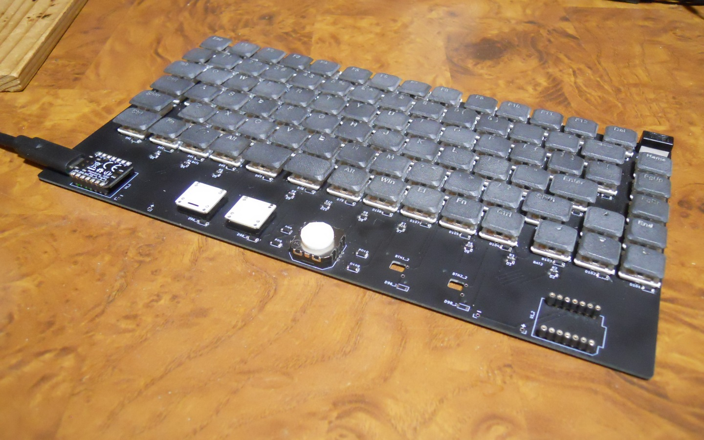
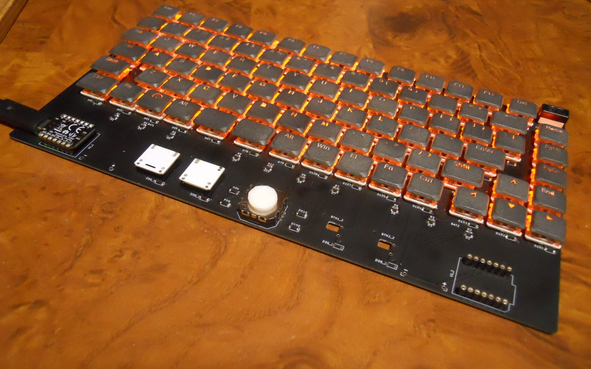
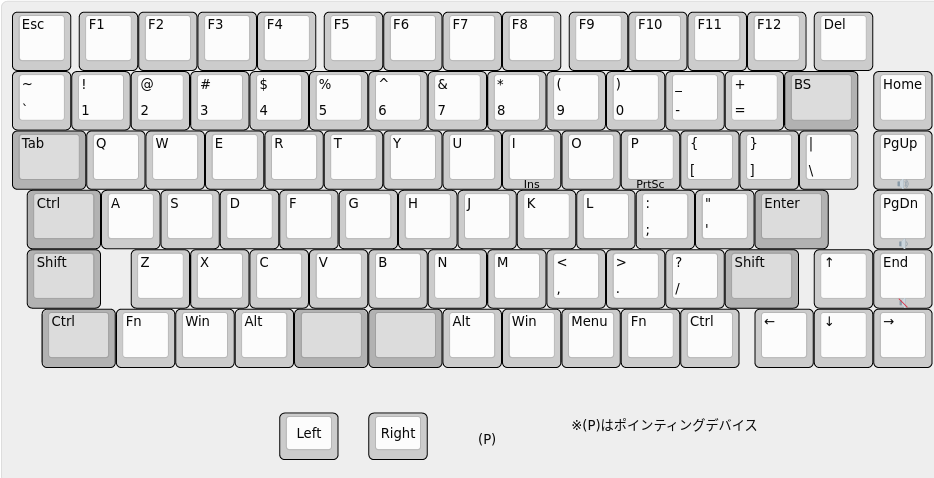

# xiao 75% keyboard

* 86 Kailh mini choc switches for keyboard keys.
* 2 Kailh X Switches for mouse buttons.
* 1 Top-up JT8P analog stick for pointing device.
* Seeed XIAO as controller.

Here is layout of xiao 75% keyboard. Darker key indicates keys with 1.25u keycap.  

I don't use `Caps Lock` key, and replaced it by `Left Control` key.

# Required parts

## Keyboard main

* 86x [Kailh PG1232 mini choc switch](https://www.aliexpress.com/item/4000277394324.html)
  * keyboard switches
* 2x [Kailh PG1425 X switch](https://www.aliexpress.com/item/32985602923.html)
  * mouse buttons
* 1x [TOP-UP JT8P-3.2T-B10K-1-16Y](https://akizukidenshi.com/catalog/g/gP-04048)
  * pointing device
* 1x [Seeed XIAO](https://akizukidenshi.com/catalog/g/gM-15178)
  * Seeed XIAO
* 88x [1N4148W](https://akizukidenshi.com/catalog/g/gI-07084)
  * SOD-123 SMD switching diode
* 4x [SS2040FL](https://akizukidenshi.com/catalog/g/gI-02073)
  * SOD-123 SMD low Vf diode
* 10x [1608Metric 560ohm SMD resistor](https://www.sengoku.co.jp/mod/sgk_cart/detail.php?code=EEHD-57GE)
* 10x [1SS355VM](https://akizukidenshi.com/catalog/g/gI-05866)
  * SOD-323 SMD switching diode
* 2x [7P pin socket](https://akizukidenshi.com/catalog/g/gP-01014)
* 1x [14P pin header](https://akizukidenshi.com/catalog/g/gC-04397)
  * split to 2x 7P pin heaeder
* 1x Keyboard PCB

## Backlight LED
* 86x [2012Metric SMD LED](https://akizukidenshi.com/catalog/g/gI-06422)
* 86x [2012Metric 2.2k ohm SMD resistor](https://www.sengoku.co.jp/mod/sgk_cart/detail.php?code=EEHD-57C4)
  * Adjust value depending on Vf of LED
* 1x [NJM12888-33](https://akizukidenshi.com/catalog/g/gI-10675)
  * SOT23-5 Voltage Regulator with enable pin
* 2x [2012Metric 0.1uF SMD capacitor](https://akizukidenshi.com/catalog/g/gP-00349)
* 1x [2012Metric 1uF SMD capacitor](https://akizukidenshi.com/catalog/g/gP-09174)
* 1x [6011S1M1 slide switch](https://akizukidenshi.com/catalog/g/gP-15365)
  * Turn on/off LEDs

# About firmware

Source code of Arduino based firmware is available under [prog](prog)

Supports only SAMD21 version of XIAO.

See [prog/README.md](prog/README.md) for details.
