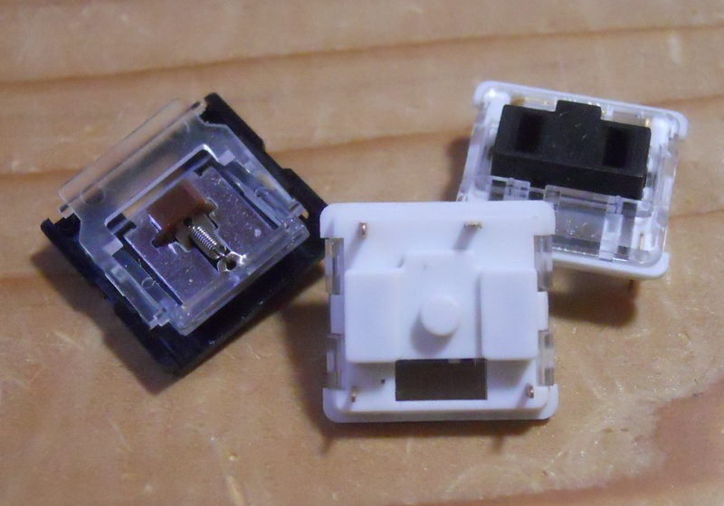
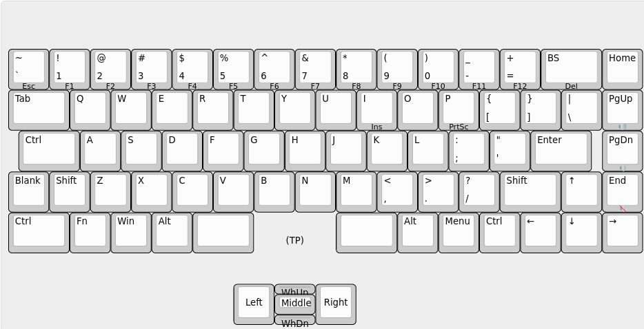
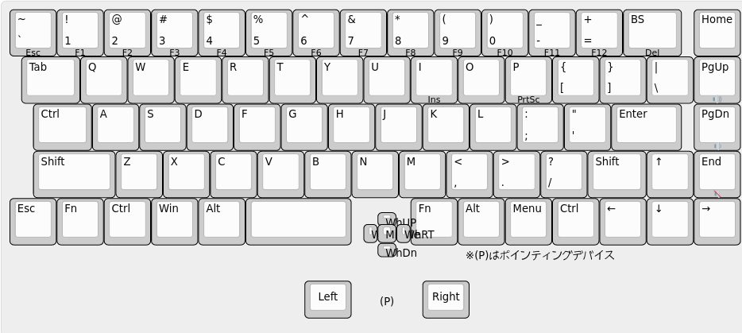

= 設計したキーボードについて語ります。

この記事は https://adventar.org/calendars/7646[キーボード #2 Advent Calendar 2022] の 2 日目です。

1日目は、おかちまちさんの https://zenn.dev/okachi_machi/articles/214e2ef4bf440e[液晶からネジが生えてた話] でした。 +
私の購入したキーボードもちょくちょくネジが外れるのですが、なにかいい対策が無いものでしょうか。

== この記事について

薄くて小さくて、でもほとんどのキーがあって、マウス操作もちょっとできるキーボード
xiao 75% keyboard を設計・実装しました。この記事は、その製作過程について語ります。

* 薄い …… キーボードの底からキーキャップの表まで、 10.7 mm。
* 小さい …… 横249mm、縦 135mm。コントローラは Seeed XIAO。
* ほとんどのキー …… Page Up/Page Down/Home/End キーと、Appキー、ファンクションキーがあります。
** InsertやPrtScrのあたりはありません。
* マウス操作 …… アナログスティックでマウスカーソルを移動でき、左右のクリックキーもあります。

== 1月. きっかけ

キー面がタッチパッドになるキーボードというのを使っていて、まあまあ良かったのですが、
1月ごろに、タッチ機能がお亡くなりになりました。

マウス操作ができるキーボードでいいのがあんまりなくて、作ることにしました。

== 2月. とりあえずマウスを試作

2月の終り頃、ジョイスティックを2種類、 https://akizukidenshi.com/catalog/g/gP-04048/[JT8P-3.2T] と https://akizukidenshi.com/catalog/g/gK-15233/[SKRHAAE010 DIP化キット] を買って試してみました。
SKRHAAE010 の方は、ゲームパッドの方向キーのような4方向スイッチだったのですが、
斜め入力ができず、マウス操作には使えないことが分かりました。

それで、マウス操作に JT8P-3.2T を使うことにし、これでマウスを作ってみました。

上がアナログスティック JT8P-3.2T でマウス操作、中央が SKRHAAE010 でスクロール、
左右の白い小さいボタンが左右クリックです。コントローラーは手持ちの Seeed XIAO です。

== 3月. 自作キーボード購入

実際に製作に入る前に、自作キーボードがどんな感じか試すべきであろうと思い、
3月19日に、かーくん氏の Angel70 を https://shop.yushakobo.jp/products/2659[遊舎工房] で買いました。

Page Up/Page Down/Home/End キーがあるキーボードで薄型というところでの選択です。
このキーボードはファンクションキーがないのですが、実際に使ってみたら、
ファンクションキーも欲しくなりました。

== 4月. キースイッチのサンプル購入

キースイッチの候補として、 Kailh Choc (PG1350) ではなく、さらに薄い
Kailh Mini Choc (PG1232) と Kailh X Switch (PG1425) のどちらかを使う検討をしていました。

4月の初めに Aliexpress で https://www.aliexpress.com/item/4000277394324.html[Kailh Mini Choc (PG1232)] と https://www.aliexpress.com/item/32985602923.html[Kailh X Switch (PG1425)] を最小ロットで買いました。

最終的に Kailh Mini Choc を採用しました。 
Kailh X Switch のキーキャップがノートPCにあるようなパッチンとはめるタイプで、
自作して16mmピッチにすることが難しかったためでした。

ただ、 Kailh X Switch もせっかく買ったので、マウスの左右クリック用に2個だけ使いました。

== 3月〜5月. 二重マトリックスの検証

コントローラに Seeed XIAO を使うのため、GPIOが11個しかなく、通常のマトリクスでは30キーまでしか扱えません。
70キー以上のキーボードを作るため、 https://blog.ikejima.org/make/keyboard/2019/12/14/keyboard-circuit.html#2%E4%B9%97%E3%83%9E%E3%83%88%E3%83%AA%E3%82%AF%E3%82%B9[二重マトリクス方式] を採用しています。

3月〜5月にかけて、二重マトリックスの検証を行いました。二重マトリックスが可能かは、
マイコンのGPIOの `H`/`L` 判定の閾値や、ダイオードの電圧降下の量に左右されますので、
電圧降下の量を測定したり、実証試験したりしました。

1. 一般的なダイオードであるところの 1N4148 の電圧降下の量を測って実現可能であることを確認しました。
2. ブレッドボード上で 3×2 のマトリクスを作って実際に同時押しが動作することを確認しました。
3. 3種類のダイオードの電圧降下の量を比べて、電圧降下の量がよりいい感じのダイオードがあるかを調べました。
** 電圧降下の量はどれでもほぼ同じくらいなことが分かりました。
4. 5×4のマトリクスの実験基板を作成して、本格的な同時押しの試験などを行いました。
** 問題なく動作しました。

== 5月. ジョイスティック配置の検討

ジョイスティックの位置を検討するため、ユニバ基板を使ってマウスボードを作りました。 +
(クリック用のスイッチが押し辛かったので、あとで Kailh X Switch を1個追加しています。)	

実際に使ったところ、 水平方向の位置は `J` キーに合わせるのが良さそうという結果になりました。

なかなか使い勝手がよく、xiao 75% keyboard が完成するまで Angel70 と一緒に運用していました。

8月頃に開催していた、 SeeedStudio の XIAO メカニカルキーボードコンテストに出しても
いいかなと思った位ですが、メカニカルキーボード要素がないことに気がついてやめました。

また、このマウスボードは、アナログスティックを組み込んだ二重マトリクス方式の
動作確認も兼ねています。

=== アナログスティックを組み込んだ二重マトリクス方式

アナログスティックには2個の可変抵抗が入っており、それぞれの可変抵抗の分圧を測ることで位置を取得します。

通常は各可変抵抗を2つのアナログ入力につないで、アナログ値を取得すると思います。

image::adventar2022/analog-read-1.png[アナログスティックを読み取る図]

しかし、 XIAO の11個しかないGPIOを2つもアナログ入力で使うのはもったいないです。

そこで、アナログスティックを二重マトリクスに組み込み、アナログスティックに加える電圧を制御することで、
1つのアナログ入力だけで済むようにしました。

マトリックスのサイズが アナログ入力を2つ使う場合 `9×8=72` ですが、1つなら `10×9=90` となります。
ただし、2マスをアナログスティックで使いますので、 使用可能なキーの数は 88個 までになります。

`D10` を `H` にし `D9` を `L` にすると `x` の位置を、
`D10` を `L` にし `D9` を `H` にすると `y` の位置を取ることができます。

ダイオードの電圧降下の分、有効範囲が低くなってしまうため、電圧降下の低いダイオードを使うようにしました。

また、スイッチの同時押しによって `D9` と `D10` がダイオードで繋がると、
`H` 出力と `L` 出力の間に大電流が流れる恐れがあります。 +
その対策として、各GPIOとスイッチの間に抵抗を接続し、流れる電流を減らしています。

== 5月. 実験基板を発注

5月21日に Elecrow に実験基板を発注し、 5月31日に到着しました。

実験基板には、二重マトリックスの試験、キースイッチのフットプリントの確認、
ネジ止め用の穴あけの確認などを盛り込みました。

2枚あれば十分なのですが、10枚ぐらい来てしまって、実はちょっと処分に困っています。

ついでに、 X Switch の 2.54mmピッチ化基板＆PCBキートップも作りました。
完成したキーボードに使っている 2つの X Switch には、このPCBキートップを取り付けています。

PCBキートップは、 shikamiya氏の https://booth.pm/ja/items/1545463[PCBキートップ for Kailh X switch] を参考にしています。

PCBキートップ を数個作るのが大変だったので、90個近く作るのは無理と思い、 X Switch は不採用になりました。

余談ですが、 2.54mmピッチ化基板には https://akizukidenshi.com/catalog/g/gI-15068/[マイコンLED WS2812-2020] 用のパターンを入れたのですが、
パターンに合わせて WS2812-2020 を取り付けると、 X Switchのパンタグラフに当たることが判明しました。

気合で気持ち上にずらして当たらない位置に実装したものの、PCBキートップが光を透過しないので
あまり意味が無かったという落ちでした。

=== 3Dモデル

基板設計には KiCad を使用していて、KiCad には基板の 3Dプレビュー機能があります。
しかし、キースイッチや XIAO などは3Dモデルがなくて悲しいので、作りました。

XIAO＝青色と思い込んでいて、青い基板にしてしまい、実物は黒い基板であること気づいたのは、だいぶ後になってからでした。

== 5月. ファームウェアを書いた

QMK が Seeed XIAO に使われているマイコン SAMD21 に対応してませんでした。
しかたがないので、Arduino ベースの単純なキーボードファームウェアを書きました。

試作マウスでは、 Arduino ベースのプログラムを書いていました。
実験基板では QMK を試してみようと思って make ファイルの書き方を調べ始めたら、
CPU に SAMD21 を使う場合の指定方法がわからず、ネットで検索して未対応らしいことが分かった次第です。

== 7月. バックライトを追加した

6月末頃、開発に使っていたノートPCがやばい感じになりまして、急遽新しいノートPCを購入しました。
CHUWI Minibook X という機種なのですが、なんかキーボードにバックライトがついていまして。
薄暗い所で使うときにバックライトがあると都合が良いということを体験しまして。

そんな訳で、7月に、配線の進んでいたキーボードに急遽バックライトを追加することになりました。
マイコン制御のLEDは、制御するためのGPIOもないし、基板上に信号線を配線するためのスペースが足りないしで、
検討の結果、普通のLEDをスライドスイッチで点灯/消灯する仕様になりました。

== 2月〜9月. キーボードレイアウトの検討

割と長い期間、キーボードレイアウトの検討をしていました。
〜5月までに大体決定して、そのあとちょこちょこ変更がありました。

3月9日の頃では、このようなレイアウトでした。

上部にコントローラを配置するためのスペースを開けて、アナログスティックは
キーボードの一部っぽくなる感じでした。
ThinkPad を意識していたので、トラックポイントの略で TP と書いていました。

ただ、実際にマウスを試作してみると、アナログスティックを
(トラックポイントのように)人差し指で操作するのは無理があり、
親指で操作するのがよさそうだといことになりました。

ということで、 4月5日に作成したレイアウト画像です。

アナログスティックを下に持ってきています。この時点では、まだ SKRHAAE010 を使う気があったようです。
Angel70 で Esc キーを左下に持ってきたのがよかったので、それが反映されています。

しかし、 Angel70 をしばらく使った結果、ファンクションキーが欲しくなり、 5月10日には、こうなりました。

ファンクションキーが追加されており、SKRHAAE010が削られています。

また、アナログスティックを右手の親指で操作するなら、左右クリックは左手で
押すのが合理的かもしれない、と思いついたため、クリックボタンが2つとも
アナログスティックの左側になりました。

これでほぼ完成ですが、空いている右上隅に、余っていたスイッチ一個を置いていました。

そして7月になって、急遽バックライトを追加することになりました。
右上隅はバックライト点灯用のスライドスイッチを置くことになり、
最終的に、こうなりました。9月17日です。

* スペースバーを2つに分割して、スペースバー2つにしました。
* 右端の列が、Enterキーとくっついてると押し間違える、という意見を聞いたので、ちょっぴり離しています。
* 右端の列とカーソルキーを除いた左右の端が、でこぼこしないようにキー配置が若干調整されています。
* キーキャップのサイズを 1u と 1.25u だけにしました。キーキャップがダメだった時に融通を利かせやすいという判断です。

キーピッチについても、 18x17mmピッチ や 17x17mmピッチ などの配列を紙に印刷して、
どれがいーかなーとやりましたが、よくわからなかったので、下限の 16x16mm にしました。

== 5月〜9月. 回路の設計・配線

自作キーボード製作で一番時間が掛かったのは配線で、5月〜7月の間は、
ずっとスイッチの並び方や配線を試行錯誤していたような記憶があります。

各列・各行に1つ穴のある 10×10 のマトリックスを 15×5 や 15×6 に並べるための、
最適なスイッチの並び方を探求したりしました。

マトリックスの同じ列は、基板上でも列の近い所、同じ行は同じ行で並べると
おおよそ最適になりますが、どうしても 2行に分けざるを得ませんし、
マトリックスに穴があるため、縦に同じ列のキーを置けない所が必ず出ます。

また、 Mini Choc のステム部分が基板ぶち抜きになっていることに加え、狭ピッチにしているので
基板上の配線スペースが少なく、縦や横の配線が一ヶ所に集中することが無いように気を使いました。

表計算ソフトのセルを使って、スイッチの位置を組み替えて、試行錯誤しました。
なるべく同じ列が縦になり、隣の列との交差が発生しないような配列を考えて、
実際に配線してみると今ひとつな点が出てきてやり直す、
ということを行ったので時間がかかりました。

キーボードレイアウトの検討と平行して配線もしていたので、
レイアウトが変更になると、並べ方も配線もやり直しになって大変でした。

とはいえ、時間が掛かった原因の7割は、揃えないと気が済まない私の気質かもしれません。

下のスクリーンショットを見てもらうと分かると思いますが、例えばスイッチ間を通る縦線が、どのスイッチの間でも同じ位置にあります。 

それだけではなく、線を曲げる位置とかもかなり揃えています。

キーの並べ方が変わると、その作業もやり直しなので、いくらか時間を無駄にしてしまいました。

（今見ると、スイッチ間の縦線がエッジに近すぎる……。）

KiCad 6 のプロジェクトファイルを https://github.com/ktmizugaki/xiao-75-keyboard/tree/main/circuit[github] で公開しているので、是非ご覧ください。

=== 配線時に気をつけたこと・改善したいことこと

基板を発注すると確実に何枚か余るので、配ることを想定して、 Choc V1 にも対応させたり、
どこかでおすすめされていた、ダイオード・LEDの向きを揃えることを行いました。

線の幅は、信号線：0.45mm、電源線：0.6mm にして、配線間はなるべく余裕を持たせています。
また、一つの信号線を複数のパッドへつなげるとき、必ず枝分かれさせて、
パッド跨ぎで繋がることを避けるようにしました。

その方が、製造不良が減ったり、断線時にリカバリーしやすくなるだろうと思ってのことです。

ハンダ付けしたスイッチやダイオードを外した結果、断線した例をいくつか見かけたので、
どれくらい効果があるかは不明ですが、そうしてみました。

配線時は、ほぼ全部 grid を 0.1mm でやっています。gridを小さくすると、揃えるのが難しくなりますので。
オートルートや勝手に迂回する機能も、半端な位置にいくので、オフにしています。

`U1_1` と `U1_2` など、選択制のパーツは、 `U1_A` と `U1_B` とかにしたかったのですが、
KiCad くんが許可してくれなかったのが悲しいです。

スイッチの番号について、1の位が同じ番号が同じ列、10の位が同じ番号が同じ行、
のようになっていた方が、基板の導通チェックする際にわかりやすいかと思います。
しかし、KiCad くんが数字以外の番号を許可してくれなかったので、1の位にAを使えず、そうできませんでした。
2桁使って `SW910`、 `SW1009` などとするのは、シルクの基板への収まりが悪いのでやめました。

裏面にも、スイッチのリファレンスをシルクで入れれば良かったと思いました。

後の方で追加した部品のリファレンスのシルクの位置をちゃんと設定していなかったのは反省点です。

あと、よく基板が届いてから気づくのですが、基板にバージョン番号入れてなかったなぁ、というのがあります。
修正が発生するのはよくあることなので、分かりやすい形で基板にバージョンを記載したいですね。

== 9月〜10月. 基板の発注・組み立て

9/25 に、ついにキーボード基板を発注しました。 Elecrow に発注して、10/5 に到着しました。
発注時、なんかその場のノリで、レジストを艶消し黒にしてしまいました(料金が上がる)。

到着後、LEDやダイオードなどハンダ付けして、一通りの動作確認をして、
問題なかったので必要なキースイッチを Aliexpress で購入しました。

そういえば、8月頃に https://www.aliexpress.com/store/1102175574[Kailhの公式ストア] が新しくできましたが、
黒い軸のリニア Mini Choc は、 https://www.aliexpress.com/store/4670072[以前のストア] でしか売っていない様で、ちゃんと買えてよかったです。

== 9月〜11月. キーキャップ

当初は https://make.dmm.com/item/1280629/[YKNキーキャップセット] を使うことも検討していたのですが、
ファンクションキーを追加したため、このセット1つでは足りなくなってしまいました。
大幅な値上げもあったので、2セット買うのちょっと……と言うことで、キーキャップも自作しました。

最初は四角とか丸を組み合わせて作っていて、今ひとつだなと思っていました。

ちょっと違うやり方を試した所、これええやんとなって、試しに印刷してみることにしました。

10/14 に 4個セットのサンプルを3Dプリントサービスに発注し、10/29 に到着しました。
費用を抑えるために、ランナーつけて1パーツ化したのですが、裏面が磨かれないのが難点です。

サンプルの完成を待つ間、フルバージョンの作成をしていました。
キーキャップに文字の形の穴を開けたり、ランナーで繋げたりです。

キーキャップ自体は FreeCAD で作っていますが、文字入れやランナー追加などは OpenSCAD を使いました。
そして、10/29 に到着したサンプルキーキャップの質感がよくて、これええやんとなって、
同日、全キー分を3Dプリントサービスに発注し、11/09 に到着しました。

表：
裏：

全部で1パーツではなく、12個組8パーツにしています。

刻印の抜きは0.4mmの厚みで底を残していたのですが、意図どおりに印刷されずに脱落した部分が出てしまいました。
ランナーも何ヶ所か折れており、調整や工夫が必要そうです。

ランナーから取り外してキーに嵌め込む作業を行い、 11/11 にひとまず完成としました。
ところどころ固いところがあったり、数が多かったので思ったより大変でした。

+++
<!-- https://twitter.com/ktmizugaki/status/1591030447328624642 -->
<blockquote class="twitter-tweet">
ひとまず完成<a href="https://twitter.com/hashtag/%E8%87%AA%E4%BD%9C%E3%82%AD%E3%83%BC%E3%83%9C%E3%83%BC%E3%83%89?src=hash&amp;ref_src=twsrc%5Etfw">#自作キーボード</a> <a href="https://t.co/310ZCkB43W">pic.twitter.com/310ZCkB43W</a>
&mdash; teru (@ktmizugaki) <a href="https://twitter.com/ktmizugaki/status/	1591030447328624642">November 11, 2022</a></blockquote>
+++

Kailh Mini Choc は、底の高さが 2.5mm のため、 1.2mm 厚の基板を2枚重ねるとちょうど良い塩梅になります。
表面実装部品を全て基板の表に配置し、ボトムプレートとして一枚基板を重ねて使用する設計になっています。

== 11月. ドキュメント書き

組み立て手順書を書いてみたりしました。

''''''''''''''''''''''''''''''''''''''''''''''''''''''''''''''''''''''''''''''

== おわり

この記事は、ノートPC CHUWI Minibook X のキーボードを使って書きました。(作ったキーボードは会社で使う用なので……。) +
10.8型という小型のノートPCのキーボードなのに、変則的ではない、ほぼ標準的な英語配列になっていて、違和感が少ないです。 +
Appキーが無いのが残念ですね。スペースバーがこんなに長くなくていいのにと思います。
