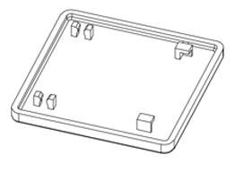
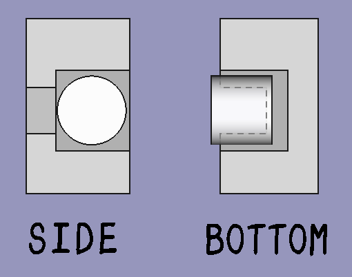
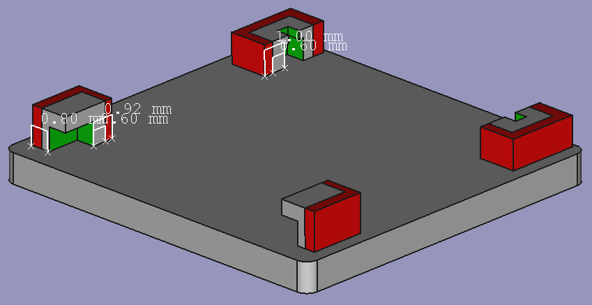

= Kailh X-Switch 用の3Dプリントキャップを作りました

公開日: 2024/01/28

== この記事について

Kailh X-Switch 用の3Dプリントキャップを作ったので備忘録です。

== きっかけ

去年の9月頃に薄いキースイッチについて調べていたら、
https://zenn.dev/paltlenparutore/articles/95a7a102ea485e[CHERRY MX Ultra Low Profileというキースイッチのキーキャップを 3Dプリントする話]
を見かけたのが直接のきっかけです。

同じような構造で X-Switch 用のキーキャップが作れないか試そうということになりました。

== 設計

公式キーキャップと同じようなキーキャップを 3Dプリントで作ろうとした場合の壁は、
スイッチの軸を保持する爪(下図の左側部分)が小さく繊細な点です。

(公式キーキャップの仕様書より引用)

まず3Dプリントでうまく出力されるか不明ですし、出力できても強度面で不安があります。

CHERRY MX Ultra Low Profile用キャップを参考にして、
爪にカチッと嵌めるのではなく、下図の様にスイッチの軸を何となく3方から包む感じにしました。

また、 X-Switch に嵌まるサイズでは3Dプリントの最小寸法に満たなかったため、厚めに製造して自分で削る方式になりました。
(削る箇所を赤で示しています)

== 微調整

嵌め込み具合がよい塩梅になるまで、微調整を2回やりました。

初版はきつくて全く嵌りませんでした。

2版で左右の幅や隙間等を大きくしたところ、緩くて簡単にはずれてしまいました。

再度調整した3版で、完璧によい感じになりましたので、完成となりました。

== まとめ

無理と思っていた X-Switch のキーキャップが自作ができて、
しかも完璧な触感で大変嬉しいです。

+++
<!-- https://twitter.com/ktmizugaki/status/1870353026135032240 -->
<blockquote class="twitter-tweet" data-media-max-width="560">
Kailh X Switch PG1425 の 3Dプリントキーキャップがいい感じに動作したので、悦に入っている。 本来の寸法だと細すぎで製造してもらえないので、厚くしたのを製造してもらって自分で細く削った。 <a href="https://t.co/Q5sRQEjml4">pic.twitter.com/Q5sRQEjml4</a>
&mdash; teru (@ktmizugaki) <a href="https://twitter.com/ktmizugaki/status/1870353026135032240?ref_src=twsrc%5Etfw">December 21, 2024</a></blockquote> 
+++

一度断念した X-Switch を使ったキーボードを作りたくなってしまいました。
このキーキャップを量産する場合は、切削を補助する治具を作りたいです。
